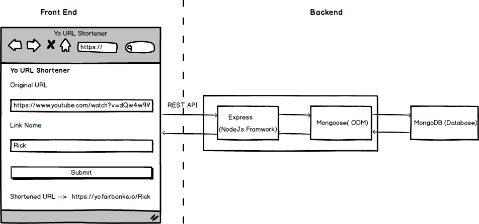

<h1 align="center">
  Yo - The URL Shortener
</h1>

Yo Dawg, heard you're tired of remembering URLs



## Dependencies

- ### Server

  - [Express](https://expressjs.com/) - Node.js Framework for Building REST APIs
  - [MongoDB](http://mongodb.com/) - Document Oriented NoSQL Database
  - [Mongoose](https://http://mongoosejs.com) - MongoDB Object Modeling
  - [Valid-url](https://github.com/ogt/valid-url) - URL Validation Functions
  - [Nginx](https://www.nginx.com) - Reverse Proxy

- ### Client

  - [React](https://reactjs.org/) - JS Library for Building UI's
  - [React-router](https://github.com/ReactTraining/react-router) - Complete Routing Library for React
  - [Materialize css](http://materializecss.com/) - Responsive Front-end Framework Based on Material UI
  - [Auth0 Lock](https://www.npmjs.com/package/auth0-lock) - Universal login and access control

## Getting Started

#### Prerequisites

The following will need to be installed before proceeding:

- Node v8+
- Mongo DB
- Nginx

#### Clone the Project

```sh
# Clone it
git clone https://github.com/jonfairbanks/yo.git
cd yo
```

#### Run Backend

```
# Move to server Folder
cd server/

# Install Dependencies
yarn install

# Start Server
yarn start
```

#### Run Front End

```
# Move to client Folder
cd client/

# Install Dependencies
yarn install

# Start Client
yarn start
```

#### Configure Nginx

Client:
```
location /manifest.json {
    proxy_pass http://127.0.0.1:3000/manifest.json;
}
location / {
    proxy_pass http://127.0.0.1:3000/;
    proxy_set_header X-Real-IP $remote_addr;
    # Upgrade for Websockets
    proxy_http_version 1.1;
    proxy_set_header Upgrade $http_upgrade;
    proxy_set_header Connection "upgrade";
}
```

Server:
```
location ~* "^/[0-9a-z!?@_-]{1,99}$"  {
    proxy_set_header X-Real-IP $remote_addr;
    rewrite ^/(.*)$ https://my-api-url.com/api/item/$1 redirect;
}
location /socket.io {
    proxy_pass http://127.0.0.1:7000;
    proxy_set_header x-real-ip $remote_addr;
    # Upgrade for Websockets
    proxy_http_version 1.1;
    proxy_set_header Upgrade $http_upgrade;
    proxy_set_header Connection "upgrade";
}
location / {
    proxy_pass http://127.0.0.1:7000;
    proxy_set_header X-Real-IP $remote_addr;
    # Upgrade for Websockets
    proxy_http_version 1.1;
    proxy_set_header Upgrade $http_upgrade;
    proxy_set_header Connection "upgrade";
}
```

## Enabling API Authentication
By default, the Yo backend API is open which would allow anyone who knew your API endpoint to list, edit or even delete links if they chose. To prevent this, you can enable Auth0 authentication for requests between the client and server. 

- Sign up for an Auth0 account @ https://auth0.com
- Create and Setup a Regular Web Application. Configure it as you see fit.
- In the Yo config.js files, set the Client and/or Domain provided by Auth0.
- Before leaving Auth0, create a user account for your application under User & Roles.
- When starting the Yo client, pass `REACT_APP_AUTH=true` as an ENV variable to enforce user logins.
- When starting the Yo server, pass `AUTH=true` as an ENV variable to enable authentication checks. 
- Navigate to Yo and login with the previously created user. If successful, you should be logged into the dashboard successfully.

By default, sign-ups via the Auth0 UI are disabled. If you would like to allow user-signup however, you can force this on by passing `REACT_APP_SIGNUPS=true` during Yo client startup. 

## Extras
- If you're using PM2 to manage your node processes, you can use the included `yo-pm2.yaml` to start and deploy the app.
- Yo can also be deployed via Docker using the included `docker-compose.yaml` file. Enter the Yo root directory and run `docker-compose up` to deploy the Yo client, backend and 

## ☑ TODO

- [x] Auto Update Tab Data
- [x] Client Dockerfile
- [x] Server Dockerfile
- [x] API Authentication
- [x] Edit/Delete Functionality
- [ ] Build and Deploy App
- [ ] Better Error Handling when Navigating to Unset Links
- [ ] Pass through for Query Parameters
- [ ] Swipeable Tabs
- [ ] Further refactor Home.js

## Contributers
Jon Fairbanks - Maintainer
