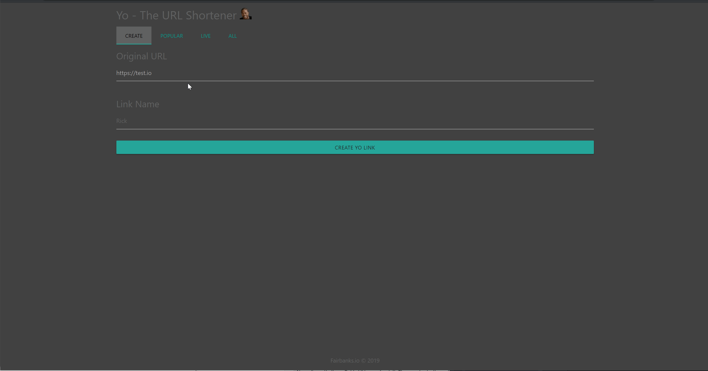

# Yo URL Shortener

[](https://github.com/jonfairbanks/yo/actions/workflows/docker-build-develop.yml)
[](https://github.com/jonfairbanks/yo/actions/workflows/npm-audit.yml)
[](https://github.com/jonfairbanks/yo/actions/workflows/npm-test.yml)
[](https://github.com/jonfairbanks/yo/blob/main/LICENSE)

`Yo` is a deployable URL shortener built as a single Next.js application with MongoDB for persistence and Auth0 for dashboard authentication.



The application supports:

- authenticated link management at `/`
- public short-link redirects at `/{slug}`
- API-based redirects at `/api/redirect/{slug}`
- dashboard views for all links, latest links, popular links, and usage stats

## Stack

- Next.js 15 Pages Router
- React 19
- MongoDB with Mongoose
- Auth0 via `@auth0/nextjs-auth0`

## Prerequisites

- Node.js 22
- npm 10+
- MongoDB
- An Auth0 application for dashboard login

## Quick Start

```sh
git clone https://github.com/jonfairbanks/yo.git
cd yo/src
npm install
```

Create `src/.env.local`, then start the development server:

```sh
npm run dev
```

The app will be available at [http://localhost:3000](http://localhost:3000).

## Docs

- [Configuration](/Users/jonfairbanks/Documents/GitHub/yo/docs/configuration.md)
- [Runtime Behavior](/Users/jonfairbanks/Documents/GitHub/yo/docs/runtime.md)
- [Deployment](/Users/jonfairbanks/Documents/GitHub/yo/docs/deployment.md)

## Local Commands

Run these commands from [`src/`](/Users/jonfairbanks/Documents/GitHub/yo/src):

| Command                   | Purpose                      |
| ------------------------- | ---------------------------- |
| `npm run dev`             | Start the development server |
| `npm run build`           | Build the production app     |
| `npm run start`           | Start the production server  |
| `npm run lint`            | Run ESLint                   |
| `npm test -- --runInBand` | Run the Jest suite in-band   |

Recommended pre-deploy checks:

```sh
npm run lint
npm test -- --runInBand
npm run build
```
